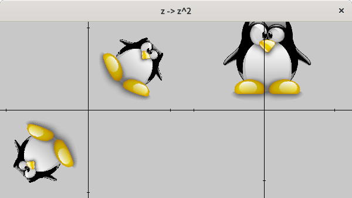
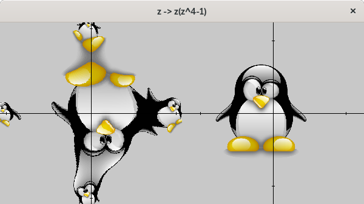

# plan_complexe

## Captures d'écran
### Racine carrée du pingouin

### Préimage du pingouin par le polynôme z(z^4-1)

## Description
Programme qui permet de visualiser les antécédents (ou préimages) d'une fonction de la variable complexe à valeurs complexes.

La fenêtre principale se divise en deux parties:

  -la partie de droite qui contient une surface représentant l'ensemble d'arrivée (C) de la fonction et sur laquelle il est possible de faire bouger une image
  
  -la partie de gauche qui contient une autre surface, représentant l'ensemble de départ (C aussi) et sur laquelle sont réprésentés les antécédents par la fonction des points de la surface de droite

## Remarques
Utilise pygame pour la gestion des événements et pour l'affichage

